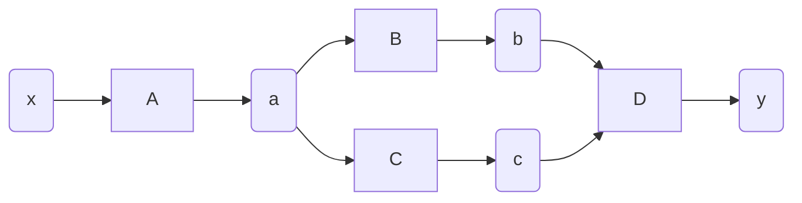

```bash
python main.py
```

### step 03
합성 함수  
```math
y = (e^{x^2})^2
```
### step 04
수치 미분 : 미세한 차이를 이용하여 함수의 변화량을 구하는 방법  
계산 비용과 정확도면에서 문제가 있음

### step 05~06
역전파

### step 07
역전파 자동화  
linked list 구조 이용

### step 09


### step 11
인수와 반환값을 리스트로 변경  
가변 길이 인수 사용
```math
y = x_0 + x_1
```

### step 13
가변 길이 인수 역전파
```math
y = x^2 + y^2
```

### step 14
같은 변수 반복 사용
```math
y = x + x + x = 3x
```
미분값 재설정
```math
y = x + x
y = x + x + x
```

### step 15~16
복잡한 계산 그래프  
다양한 위상의 계산 그래프에 대응  
세대 수가 큰 쪽부터 처리  
```math
y = (x^2)^2 + (x^2)^2
```

