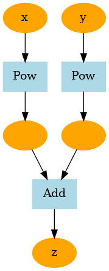
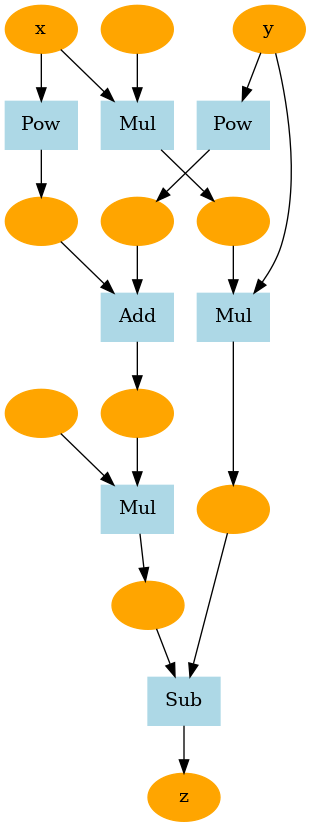
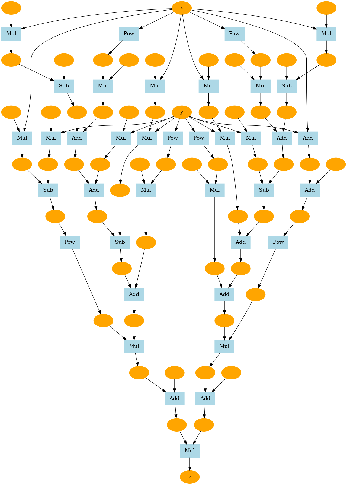
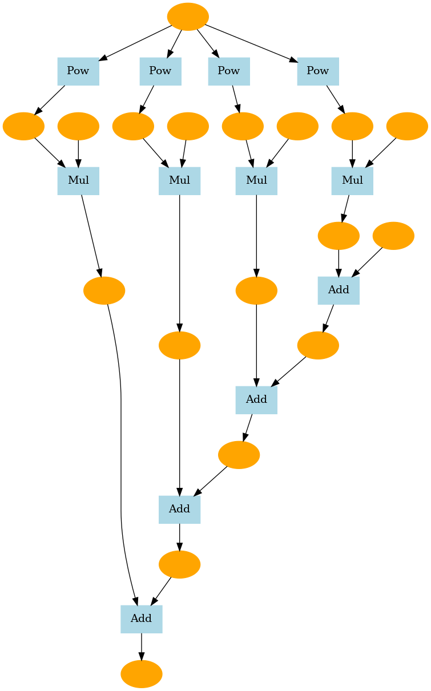

### step 24
```bash
python step24.py
```
Sphere 함수
```math
z = x^2 + y^2
```


matyas 함수
```math
z = 0.26(x^2 + y^2) - 0.48xy
```


Goldstein-Price 함수
```math
f(x,y) = [1 + (x + y + 1)^2(19 - 14x + 3x^2 - 14y + 6xy + 3y^2)]  
         [30 + (2x - 3y)^2(18 - 32x + 12x^2 + 48y - 36xy + 27y^2)]
```


### step 27
```bash
python step27.py
```
sin 클래스
테일러 급수 이론
```math
sin(x) = \frac{x}{1!} - \frac{x^3}{3!} + \frac{x^5}{5!} - ... = \sum^{\infty}_{i=0}(-1)^i\frac{x^{2i+1}}{(2i+1)!}
```

